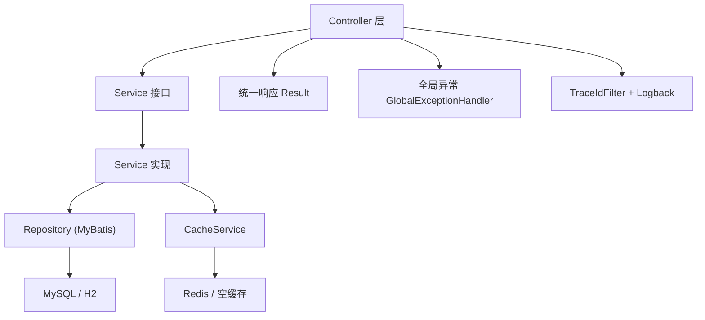
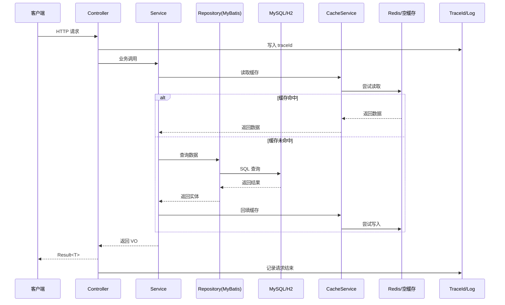
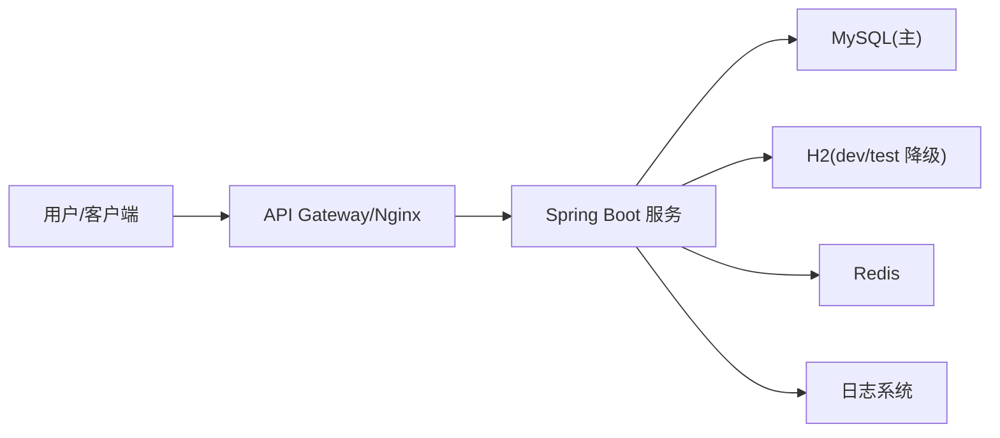

# 架构说明

## 代码架构图

```mermaid
graph TD
  A["Controller 层"] --> B["Service 接口"]
  B --> C["Service 实现"]
  C --> D["Repository (MyBatis)"]
  D --> E["MySQL / H2"]
  C --> F["CacheService"]
  F --> J["Redis / 空缓存"]
  A --> G["统一响应 Result<T>"]
  A --> H["全局异常 GlobalExceptionHandler"]
  A --> I["TraceIdFilter + Logback"]
```

## 运行流程图

```mermaid
sequenceDiagram
  participant Client as 客户端
  participant Controller as Controller
  participant Service as Service
  participant Repo as Repository(MyBatis)
  participant DB as MySQL/H2
  participant Cache as CacheService
  participant Redis as Redis/空缓存
  participant Log as TraceId/Log

  Client->>Controller: HTTP 请求
  Controller->>Log: 写入 traceId
  Controller->>Service: 业务调用
  Service->>Cache: 读取缓存
  Cache->>Redis: 尝试读取
  alt 缓存命中
    Redis-->>Cache: 返回数据
    Cache-->>Service: 返回数据
  else 缓存未命中
    Service->>Repo: 查询数据
    Repo->>DB: SQL 查询
    DB-->>Repo: 返回结果
    Repo-->>Service: 返回实体
    Service->>Cache: 回填缓存
    Cache->>Redis: 尝试写入
  end
  Service-->>Controller: 返回 VO
  Controller-->>Client: Result<T>
  Controller->>Log: 记录请求结束
```

## 部署拓扑图

```mermaid
graph LR
  U["用户/客户端"] --> GW["API Gateway/Nginx"]
  GW --> APP["Spring Boot 服务"]
  APP --> DB["MySQL(主)"]
  APP --> H2["H2(dev/test 降级)"]
  APP --> R["Redis"]
  APP --> LOG["日志系统"]
```
