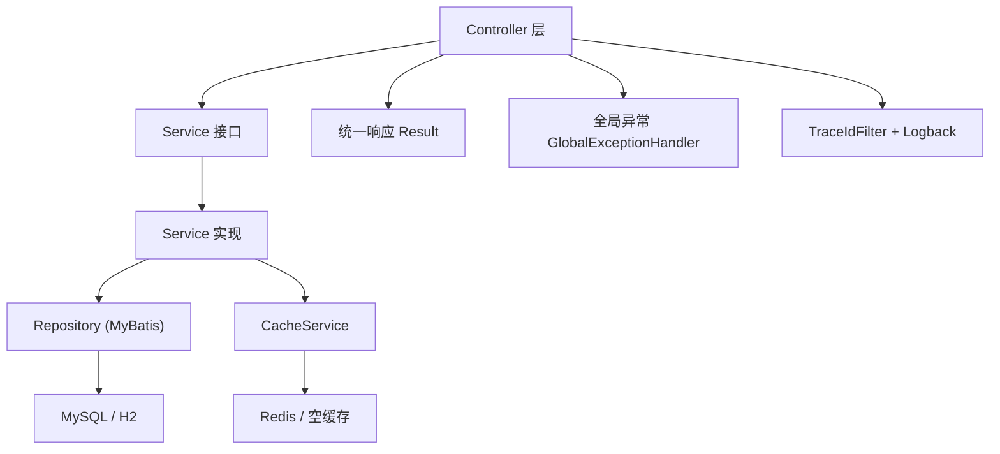
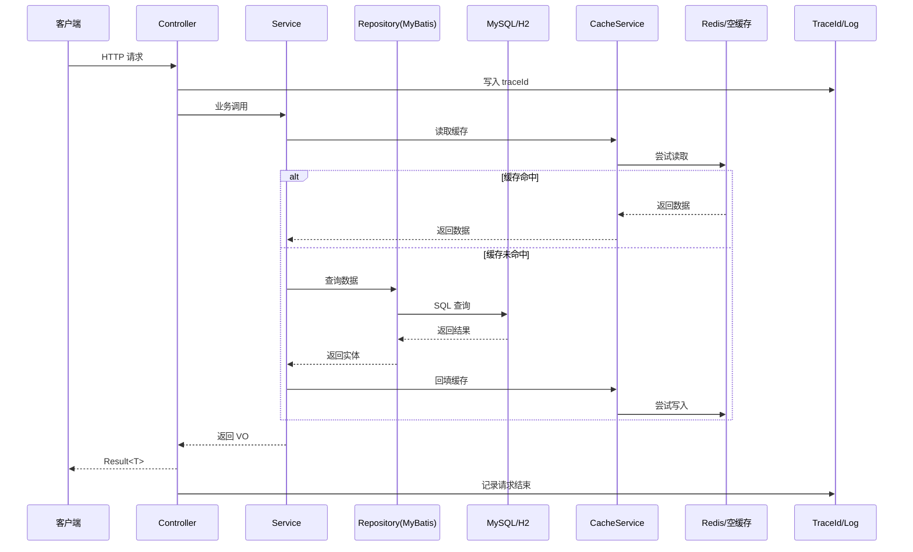
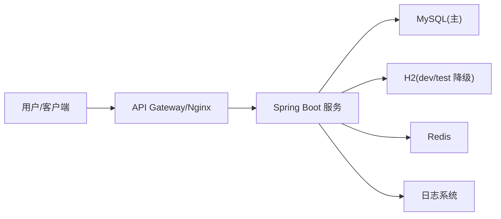

# Server Template Optimization Implementation Plan

> **For agentic workers:** REQUIRED SUB-SKILL: Use superpowers:subagent-driven-development (recommended) or superpowers:executing-plans to implement this plan task-by-task. Steps use checkbox (`- [ ]`) syntax for tracking.

**Goal:** Refine the Spring Boot AI server template into a medium production baseline with typed configuration, cleaner cache behavior, simpler errors, focused tests, and better documentation structure.

**Architecture:** Keep the existing three-layer Spring Boot structure. Move infrastructure decisions behind typed properties and small interfaces: `AppDatasourceProperties` for datasource fallback, `AppRedisProperties` for Redis enablement, `CacheService` for cache access, and focused docs for architecture decisions.

**Tech Stack:** Java 21, Spring Boot 3.x, Gradle Kotlin DSL, MyBatis XML, Redis, H2, JUnit 5, Mockito.

---

## File Structure

- Create: `src/main/java/org/xinhuamm/demo/config/AppDatasourceProperties.java`
  - Owns `app.datasource.fallback-enabled` with type-safe binding and validation.
- Create: `src/main/java/org/xinhuamm/demo/config/AppRedisProperties.java`
  - Owns `app.redis.enabled` with type-safe binding.
- Modify: `src/main/java/org/xinhuamm/demo/DemoApplication.java`
  - Enables the new configuration properties classes.
- Modify: `src/main/java/org/xinhuamm/demo/config/DataSourceAutoSwitchConfig.java`
  - Replaces raw `@Value` with `AppDatasourceProperties`.
- Modify: `src/main/java/org/xinhuamm/demo/config/RedisAvailability.java`
  - Replaces raw `@Value` with `AppRedisProperties`.
- Create: `src/main/java/org/xinhuamm/demo/common/cache/NoopCacheService.java`
  - Provides empty cache behavior when Redis is disabled.
- Modify: `src/main/java/org/xinhuamm/demo/common/cache/RedisCacheService.java`
  - Activates only when `app.redis.enabled=true`.
- Modify: `src/main/java/org/xinhuamm/demo/config/RedisConfig.java`
  - Keeps Redis beans conditional on `app.redis.enabled=true`.
- Modify: `src/main/java/org/xinhuamm/demo/common/exception/BusinessException.java`
  - Adds an error code field.
- Modify: `src/main/java/org/xinhuamm/demo/common/exception/GlobalExceptionHandler.java`
  - Uses `BusinessException#getCode()`.
- Create: `src/test/java/org/xinhuamm/demo/common/cache/NoopCacheServiceTest.java`
  - Verifies disabled cache behavior.
- Create: `src/test/java/org/xinhuamm/demo/service/impl/UserServiceImplTest.java`
  - Tests cache hit, cache miss, and user-not-found paths.
- Modify: `README.md`
  - Shortens main README and links to architecture docs.
- Create: `docs/architecture.md`
  - Moves architecture diagrams and runtime flow out of README.
- Create: `docs/decisions/0001-template-scope.md`
  - Records why the template is medium production baseline.
- Modify: `ai-spec.yaml`
  - Adds typed configuration and Noop cache conventions.

---

### Task 1: Add Typed Application Properties

**Files:**
- Create: `src/main/java/org/xinhuamm/demo/config/AppDatasourceProperties.java`
- Create: `src/main/java/org/xinhuamm/demo/config/AppRedisProperties.java`
- Modify: `src/main/java/org/xinhuamm/demo/DemoApplication.java`
- Modify: `src/main/java/org/xinhuamm/demo/config/DataSourceAutoSwitchConfig.java`
- Modify: `src/main/java/org/xinhuamm/demo/config/RedisAvailability.java`

- [ ] **Step 1: Create typed datasource properties**

Create `src/main/java/org/xinhuamm/demo/config/AppDatasourceProperties.java`:

```java
package org.xinhuamm.demo.config;

import org.springframework.boot.context.properties.ConfigurationProperties;
import org.springframework.validation.annotation.Validated;

/**
 * 应用数据源扩展配置。
 * 用于控制开发/测试环境中的 H2 降级能力。
 */
@Validated
@ConfigurationProperties(prefix = "app.datasource")
public class AppDatasourceProperties {

    /**
     * 是否允许 MySQL 不可用时降级到 H2。
     */
    private boolean fallbackEnabled;

    public boolean isFallbackEnabled() {
        return fallbackEnabled;
    }

    public void setFallbackEnabled(boolean fallbackEnabled) {
        this.fallbackEnabled = fallbackEnabled;
    }
}
```

- [ ] **Step 2: Create typed Redis properties**

Create `src/main/java/org/xinhuamm/demo/config/AppRedisProperties.java`:

```java
package org.xinhuamm.demo.config;

import org.springframework.boot.context.properties.ConfigurationProperties;
import org.springframework.validation.annotation.Validated;

/**
 * 应用 Redis 扩展配置。
 * 用于控制缓存能力是否启用。
 */
@Validated
@ConfigurationProperties(prefix = "app.redis")
public class AppRedisProperties {

    /**
     * 是否启用 Redis 缓存。
     */
    private boolean enabled = true;

    public boolean isEnabled() {
        return enabled;
    }

    public void setEnabled(boolean enabled) {
        this.enabled = enabled;
    }
}
```

- [ ] **Step 3: Enable typed properties in the application**

Modify `src/main/java/org/xinhuamm/demo/DemoApplication.java` to include `@EnableConfigurationProperties`:

```java
package org.xinhuamm.demo;

import org.mybatis.spring.annotation.MapperScan;
import org.springframework.boot.SpringApplication;
import org.springframework.boot.autoconfigure.SpringBootApplication;
import org.springframework.boot.context.properties.EnableConfigurationProperties;
import org.springframework.scheduling.annotation.EnableAsync;
import org.xinhuamm.demo.config.AppDatasourceProperties;
import org.xinhuamm.demo.config.AppRedisProperties;
import org.xinhuamm.demo.config.H2DataSourceProperties;

/**
 * 应用启动类。
 * 负责启动 Spring Boot 应用并扫描 MyBatis Mapper。
 */
@SpringBootApplication
@MapperScan("org.xinhuamm.demo.repository")
@EnableAsync
@EnableConfigurationProperties({
        AppDatasourceProperties.class,
        AppRedisProperties.class,
        H2DataSourceProperties.class
})
public class DemoApplication {

    /**
     * 应用主入口。
     *
     * @param args 启动参数
     */
    public static void main(String[] args) {
        SpringApplication.run(DemoApplication.class, args);
    }
}
```

- [ ] **Step 4: Replace raw datasource fallback property**

Modify `src/main/java/org/xinhuamm/demo/config/DataSourceAutoSwitchConfig.java`:

```java
package org.xinhuamm.demo.config;

import lombok.extern.slf4j.Slf4j;
import org.springframework.boot.autoconfigure.jdbc.DataSourceProperties;
import org.springframework.context.annotation.Bean;
import org.springframework.context.annotation.Configuration;
import org.springframework.context.annotation.Primary;
import org.springframework.core.io.ClassPathResource;
import org.springframework.jdbc.datasource.init.ResourceDatabasePopulator;

import javax.sql.DataSource;
import java.sql.Connection;

/**
 * 数据源自动切换配置。
 * 自动探测 MySQL 是否可用，不可用时按环境配置降级为 H2。
 */
@Slf4j
@Configuration
public class DataSourceAutoSwitchConfig {

    private final DataSourceProperties mysqlProperties;
    private final H2DataSourceProperties h2Properties;
    private final AppDatasourceProperties appDatasourceProperties;

    public DataSourceAutoSwitchConfig(DataSourceProperties mysqlProperties,
                                      H2DataSourceProperties h2Properties,
                                      AppDatasourceProperties appDatasourceProperties) {
        this.mysqlProperties = mysqlProperties;
        this.h2Properties = h2Properties;
        this.appDatasourceProperties = appDatasourceProperties;
    }

    /**
     * 构建主数据源，MySQL 优先，失败后仅在允许的环境降级到 H2。
     *
     * @return DataSource
     */
    @Bean
    @Primary
    public DataSource dataSource() {
        DataSource mysqlDataSource = mysqlProperties.initializeDataSourceBuilder().build();
        if (isAvailable(mysqlDataSource)) {
            log.info("检测到 MySQL 可用，使用 MySQL 数据源");
            return mysqlDataSource;
        }
        if (!appDatasourceProperties.isFallbackEnabled()) {
            throw new IllegalStateException("MySQL 不可用，且当前环境未开启 H2 降级");
        }

        DataSource h2DataSource = org.springframework.boot.jdbc.DataSourceBuilder.create()
                .url(h2Properties.getUrl())
                .driverClassName(h2Properties.getDriverClassName())
                .username(h2Properties.getUsername())
                .password(h2Properties.getPassword())
                .build();
        initH2Schema(h2DataSource);
        log.warn("MySQL 不可用，已自动切换到 H2 内存数据库");
        return h2DataSource;
    }

    private boolean isAvailable(DataSource dataSource) {
        try (Connection connection = dataSource.getConnection()) {
            return connection != null && connection.isValid(2);
        } catch (Exception ex) {
            log.warn("MySQL 探测失败，原因={}", ex.getMessage());
            return false;
        }
    }

    private void initH2Schema(DataSource dataSource) {
        ResourceDatabasePopulator populator = new ResourceDatabasePopulator();
        populator.addScript(new ClassPathResource("schema.sql"));
        populator.execute(dataSource);
    }
}
```

- [ ] **Step 5: Replace raw Redis enabled property**

Modify `src/main/java/org/xinhuamm/demo/config/RedisAvailability.java`:

```java
package org.xinhuamm.demo.config;

import jakarta.annotation.PostConstruct;
import lombok.extern.slf4j.Slf4j;
import org.springframework.beans.factory.ObjectProvider;
import org.springframework.context.annotation.Configuration;
import org.springframework.data.redis.connection.RedisConnection;
import org.springframework.data.redis.connection.RedisConnectionFactory;

/**
 * Redis 可用性检测。
 * 自动判断 Redis 是否可用，作为缓存开关的运行时依据。
 */
@Slf4j
@Configuration
public class RedisAvailability {

    private final ObjectProvider<RedisConnectionFactory> connectionFactoryProvider;
    private final AppRedisProperties appRedisProperties;

    private volatile boolean available;

    public RedisAvailability(ObjectProvider<RedisConnectionFactory> connectionFactoryProvider,
                             AppRedisProperties appRedisProperties) {
        this.connectionFactoryProvider = connectionFactoryProvider;
        this.appRedisProperties = appRedisProperties;
    }

    @PostConstruct
    public void detect() {
        if (!appRedisProperties.isEnabled()) {
            available = false;
            log.warn("Redis 已在配置中关闭");
            return;
        }
        RedisConnectionFactory factory = connectionFactoryProvider.getIfAvailable();
        if (factory == null) {
            available = false;
            log.warn("未检测到 Redis 连接工厂，缓存自动关闭");
            return;
        }
        try (RedisConnection connection = factory.getConnection()) {
            String pong = connection.ping();
            available = "PONG".equalsIgnoreCase(pong);
            if (available) {
                log.info("Redis 可用，缓存已启用");
            } else {
                log.warn("Redis ping 失败，缓存自动关闭");
            }
        } catch (Exception ex) {
            available = false;
            log.warn("Redis 探测失败，缓存自动关闭，原因={}", ex.getMessage());
        }
    }

    public boolean isAvailable() {
        return available;
    }
}
```

- [ ] **Step 6: Run compile check**

Run:

```bash
./gradlew compileJava
```

Expected: `BUILD SUCCESSFUL`.

- [ ] **Step 7: Commit typed properties**

Run:

```bash
git add src/main/java/org/xinhuamm/demo/DemoApplication.java \
  src/main/java/org/xinhuamm/demo/config/AppDatasourceProperties.java \
  src/main/java/org/xinhuamm/demo/config/AppRedisProperties.java \
  src/main/java/org/xinhuamm/demo/config/DataSourceAutoSwitchConfig.java \
  src/main/java/org/xinhuamm/demo/config/RedisAvailability.java
git commit -m "引入应用配置属性绑定"
```

Expected: commit succeeds.

---

### Task 2: Add Noop Cache Implementation

**Files:**
- Create: `src/main/java/org/xinhuamm/demo/common/cache/NoopCacheService.java`
- Modify: `src/main/java/org/xinhuamm/demo/common/cache/RedisCacheService.java`
- Modify: `src/main/java/org/xinhuamm/demo/config/RedisConfig.java`
- Test: `src/test/java/org/xinhuamm/demo/common/cache/NoopCacheServiceTest.java`

- [ ] **Step 1: Write failing Noop cache test**

Create `src/test/java/org/xinhuamm/demo/common/cache/NoopCacheServiceTest.java`:

```java
package org.xinhuamm.demo.common.cache;

import org.junit.jupiter.api.Assertions;
import org.junit.jupiter.api.Test;

import java.time.Duration;

/**
 * NoopCacheService 单元测试。
 * 验证 Redis 关闭时缓存层不会影响主链路。
 */
class NoopCacheServiceTest {

    @Test
    void shouldAlwaysReturnEmptyWhenCacheDisabled() {
        CacheService cacheService = new NoopCacheService();

        cacheService.put("user:1", "value", Duration.ofMinutes(1));

        Assertions.assertTrue(cacheService.get("user:1", String.class).isEmpty());
    }
}
```

- [ ] **Step 2: Run the test to verify it fails**

Run:

```bash
./gradlew test --tests "org.xinhuamm.demo.common.cache.NoopCacheServiceTest"
```

Expected: FAIL because `NoopCacheService` does not exist.

- [ ] **Step 3: Implement Noop cache service**

Create `src/main/java/org/xinhuamm/demo/common/cache/NoopCacheService.java`:

```java
package org.xinhuamm.demo.common.cache;

import org.springframework.boot.autoconfigure.condition.ConditionalOnProperty;
import org.springframework.stereotype.Service;

import java.time.Duration;
import java.util.Optional;

/**
 * 空缓存实现。
 * 当 Redis 被关闭时使用，保证业务链路不依赖缓存。
 */
@Service
@ConditionalOnProperty(prefix = "app.redis", name = "enabled", havingValue = "false")
public class NoopCacheService implements CacheService {

    @Override
    public <T> Optional<T> get(String key, Class<T> clazz) {
        return Optional.empty();
    }

    @Override
    public void put(String key, Object value, Duration ttl) {
        // Redis 关闭时忽略缓存写入。
    }
}
```

- [ ] **Step 4: Make Redis cache service conditional**

Modify `src/main/java/org/xinhuamm/demo/common/cache/RedisCacheService.java`:

```java
package org.xinhuamm.demo.common.cache;

import lombok.RequiredArgsConstructor;
import lombok.extern.slf4j.Slf4j;
import org.springframework.beans.factory.ObjectProvider;
import org.springframework.boot.autoconfigure.condition.ConditionalOnProperty;
import org.springframework.data.redis.core.RedisTemplate;
import org.springframework.stereotype.Service;
import org.xinhuamm.demo.config.RedisAvailability;

import java.time.Duration;
import java.util.Optional;

/**
 * Redis 缓存服务实现。
 * Redis 不可用时自动降级为空缓存，不影响主业务链路。
 */
@Slf4j
@Service
@RequiredArgsConstructor
@ConditionalOnProperty(prefix = "app.redis", name = "enabled", havingValue = "true", matchIfMissing = true)
public class RedisCacheService implements CacheService {

    private final ObjectProvider<RedisTemplate<String, Object>> redisTemplateProvider;
    private final RedisAvailability redisAvailability;

    @Override
    public <T> Optional<T> get(String key, Class<T> clazz) {
        if (!redisAvailability.isAvailable()) {
            return Optional.empty();
        }
        RedisTemplate<String, Object> redisTemplate = redisTemplateProvider.getIfAvailable();
        if (redisTemplate == null) {
            return Optional.empty();
        }
        try {
            Object value = redisTemplate.opsForValue().get(key);
            if (clazz.isInstance(value)) {
                return Optional.of(clazz.cast(value));
            }
            return Optional.empty();
        } catch (Exception ex) {
            log.warn("读取缓存失败，key={}，原因={}", key, ex.getMessage());
            return Optional.empty();
        }
    }

    @Override
    public void put(String key, Object value, Duration ttl) {
        if (!redisAvailability.isAvailable()) {
            return;
        }
        RedisTemplate<String, Object> redisTemplate = redisTemplateProvider.getIfAvailable();
        if (redisTemplate == null) {
            return;
        }
        try {
            redisTemplate.opsForValue().set(key, value, ttl);
        } catch (Exception ex) {
            log.warn("写入缓存失败，key={}，原因={}", key, ex.getMessage());
        }
    }
}
```

- [ ] **Step 5: Confirm RedisConfig remains conditional**

Ensure `src/main/java/org/xinhuamm/demo/config/RedisConfig.java` keeps this annotation on the `redisTemplate` bean:

```java
@ConditionalOnProperty(prefix = "app.redis", name = "enabled", havingValue = "true", matchIfMissing = true)
```

- [ ] **Step 6: Run Noop cache test**

Run:

```bash
./gradlew test --tests "org.xinhuamm.demo.common.cache.NoopCacheServiceTest"
```

Expected: PASS.

- [ ] **Step 7: Commit Noop cache implementation**

Run:

```bash
git add src/main/java/org/xinhuamm/demo/common/cache/NoopCacheService.java \
  src/main/java/org/xinhuamm/demo/common/cache/RedisCacheService.java \
  src/main/java/org/xinhuamm/demo/config/RedisConfig.java \
  src/test/java/org/xinhuamm/demo/common/cache/NoopCacheServiceTest.java
git commit -m "增加空缓存实现"
```

Expected: commit succeeds.

---

### Task 3: Add Error Code to BusinessException

**Files:**
- Modify: `src/main/java/org/xinhuamm/demo/common/exception/BusinessException.java`
- Modify: `src/main/java/org/xinhuamm/demo/common/exception/GlobalExceptionHandler.java`
- Test: `src/test/java/org/xinhuamm/demo/common/exception/BusinessExceptionTest.java`

- [ ] **Step 1: Write failing BusinessException test**

Create `src/test/java/org/xinhuamm/demo/common/exception/BusinessExceptionTest.java`:

```java
package org.xinhuamm.demo.common.exception;

import org.junit.jupiter.api.Assertions;
import org.junit.jupiter.api.Test;

/**
 * BusinessException 单元测试。
 */
class BusinessExceptionTest {

    @Test
    void shouldUseDefaultBusinessCode() {
        BusinessException exception = new BusinessException("用户不存在");

        Assertions.assertEquals(4001, exception.getCode());
        Assertions.assertEquals("用户不存在", exception.getMessage());
    }

    @Test
    void shouldUseCustomBusinessCode() {
        BusinessException exception = new BusinessException(4002, "用户已存在");

        Assertions.assertEquals(4002, exception.getCode());
        Assertions.assertEquals("用户已存在", exception.getMessage());
    }
}
```

- [ ] **Step 2: Run the test to verify it fails**

Run:

```bash
./gradlew test --tests "org.xinhuamm.demo.common.exception.BusinessExceptionTest"
```

Expected: FAIL because `getCode()` and custom constructor do not exist.

- [ ] **Step 3: Implement coded BusinessException**

Modify `src/main/java/org/xinhuamm/demo/common/exception/BusinessException.java`:

```java
package org.xinhuamm.demo.common.exception;

/**
 * 业务异常。
 * 用于 Service 层表达明确的业务错误。
 */
public class BusinessException extends RuntimeException {

    /**
     * 默认业务错误码。
     */
    public static final int DEFAULT_CODE = 4001;

    private final int code;

    public BusinessException(String message) {
        this(DEFAULT_CODE, message);
    }

    public BusinessException(int code, String message) {
        super(message);
        this.code = code;
    }

    public int getCode() {
        return code;
    }
}
```

- [ ] **Step 4: Use exception code in global handler**

Modify the `handleBusinessException` method in `src/main/java/org/xinhuamm/demo/common/exception/GlobalExceptionHandler.java`:

```java
@ExceptionHandler(BusinessException.class)
public Result<Void> handleBusinessException(BusinessException ex) {
    return Result.error(ex.getCode(), ex.getMessage());
}
```

- [ ] **Step 5: Run BusinessException test**

Run:

```bash
./gradlew test --tests "org.xinhuamm.demo.common.exception.BusinessExceptionTest"
```

Expected: PASS.

- [ ] **Step 6: Commit coded business exception**

Run:

```bash
git add src/main/java/org/xinhuamm/demo/common/exception/BusinessException.java \
  src/main/java/org/xinhuamm/demo/common/exception/GlobalExceptionHandler.java \
  src/test/java/org/xinhuamm/demo/common/exception/BusinessExceptionTest.java
git commit -m "为业务异常增加错误码"
```

Expected: commit succeeds.

---

### Task 4: Add UserService Unit Tests

**Files:**
- Test: `src/test/java/org/xinhuamm/demo/service/impl/UserServiceImplTest.java`

- [ ] **Step 1: Create UserServiceImpl unit test**

Create `src/test/java/org/xinhuamm/demo/service/impl/UserServiceImplTest.java`:

```java
package org.xinhuamm.demo.service.impl;

import org.junit.jupiter.api.Assertions;
import org.junit.jupiter.api.BeforeEach;
import org.junit.jupiter.api.Test;
import org.mockito.Mockito;
import org.xinhuamm.demo.common.cache.CacheService;
import org.xinhuamm.demo.common.exception.BusinessException;
import org.xinhuamm.demo.dto.UserDTO;
import org.xinhuamm.demo.entity.UserEntity;
import org.xinhuamm.demo.repository.UserMapper;
import org.xinhuamm.demo.vo.UserVO;

import java.time.Duration;
import java.time.LocalDateTime;
import java.util.Optional;

import static org.mockito.ArgumentMatchers.any;
import static org.mockito.ArgumentMatchers.eq;

/**
 * UserServiceImpl 单元测试。
 */
class UserServiceImplTest {

    private UserMapper userMapper;
    private CacheService cacheService;
    private UserServiceImpl userService;

    @BeforeEach
    void setUp() {
        userMapper = Mockito.mock(UserMapper.class);
        cacheService = Mockito.mock(CacheService.class);
        userService = new UserServiceImpl(userMapper, cacheService);
    }

    @Test
    void shouldReturnUserFromCacheWhenCacheHit() {
        UserVO cached = new UserVO();
        cached.setId(1L);
        cached.setUsername("cached-user");
        Mockito.when(cacheService.get("user:detail:1", UserVO.class)).thenReturn(Optional.of(cached));

        UserVO result = userService.getUserById(1L);

        Assertions.assertEquals("cached-user", result.getUsername());
        Mockito.verify(userMapper, Mockito.never()).selectById(any());
    }

    @Test
    void shouldQueryDatabaseAndBackfillCacheWhenCacheMiss() {
        Mockito.when(cacheService.get("user:detail:1", UserVO.class)).thenReturn(Optional.empty());
        UserEntity entity = new UserEntity();
        entity.setId(1L);
        entity.setUsername("db-user");
        entity.setEmail("db@example.com");
        entity.setAge(20);
        entity.setCreatedAt(LocalDateTime.now());
        Mockito.when(userMapper.selectById(1L)).thenReturn(entity);

        UserVO result = userService.getUserById(1L);

        Assertions.assertEquals("db-user", result.getUsername());
        Mockito.verify(cacheService).put(eq("user:detail:1"), any(UserVO.class), eq(Duration.ofMinutes(30)));
    }

    @Test
    void shouldThrowBusinessExceptionWhenUserMissing() {
        Mockito.when(cacheService.get("user:detail:1", UserVO.class)).thenReturn(Optional.empty());
        Mockito.when(userMapper.selectById(1L)).thenReturn(null);

        BusinessException exception = Assertions.assertThrows(
                BusinessException.class,
                () -> userService.getUserById(1L)
        );

        Assertions.assertEquals("用户不存在", exception.getMessage());
    }

    @Test
    void shouldCreateUserAndBackfillCache() {
        UserDTO userDTO = new UserDTO();
        userDTO.setUsername("new-user");
        userDTO.setEmail("new@example.com");
        userDTO.setAge(18);
        Mockito.when(userMapper.insert(any(UserEntity.class))).thenAnswer(invocation -> {
            UserEntity entity = invocation.getArgument(0);
            entity.setId(10L);
            return 1;
        });

        UserVO result = userService.createUser(userDTO);

        Assertions.assertEquals(10L, result.getId());
        Assertions.assertEquals("new-user", result.getUsername());
        Mockito.verify(cacheService).put(eq("user:detail:10"), any(UserVO.class), eq(Duration.ofMinutes(30)));
    }
}
```

- [ ] **Step 2: Run UserServiceImpl tests**

Run:

```bash
./gradlew test --tests "org.xinhuamm.demo.service.impl.UserServiceImplTest"
```

Expected: PASS.

- [ ] **Step 3: Commit UserService tests**

Run:

```bash
git add src/test/java/org/xinhuamm/demo/service/impl/UserServiceImplTest.java
git commit -m "补充用户服务单元测试"
```

Expected: commit succeeds.

---

### Task 5: Move Architecture Details Out of README

**Files:**
- Modify: `README.md`
- Create: `docs/architecture.md`
- Create: `docs/decisions/0001-template-scope.md`

- [ ] **Step 1: Create architecture document**

Create `docs/architecture.md`:

````markdown
# 架构说明

## 代码架构图



## 运行流程图



## 部署拓扑图


````

- [ ] **Step 2: Create architecture decision record**

Create `docs/decisions/0001-template-scope.md`:

```markdown
# 0001 选择中等生产模板定位

## 决策

本脚手架定位为中等生产级 Spring Boot AI 协作基线。

## 原因

极简模板启动快，但真实业务落地时会反复补基础设施。企业级模板能力完整，但容易变成平台工程，增加学习和维护成本。

中等生产模板保留统一返回、异常处理、MyBatis XML、缓存抽象、TraceId 日志、三环境配置和基础线程池配置，让团队可以直接进入业务开发。

## 非目标

默认不接入权限、审计、限流、幂等、消息队列、分布式事务、Docker、CI 和 OpenAPI。这些能力按业务需要作为可选模块加入。
```

- [ ] **Step 3: Shorten README and link architecture doc**

Modify `README.md` so it keeps package structure and replaces the long diagram sections with this link:

```markdown
## 架构说明

详细代码架构图、运行流程图和部署拓扑图见 `docs/architecture.md`。
```

- [ ] **Step 4: Verify docs references**

Run:

```bash
rg "docs/architecture.md|docs/decisions/0001-template-scope.md" README.md docs
```

Expected: command prints references to both docs.

- [ ] **Step 5: Commit docs restructure**

Run:

```bash
git add README.md docs/architecture.md docs/decisions/0001-template-scope.md
git commit -m "整理脚手架架构文档"
```

Expected: commit succeeds.

---

### Task 6: Update AI Spec for New Boundaries

**Files:**
- Modify: `ai-spec.yaml`

- [ ] **Step 1: Update cache architecture section**

Modify the `architecture.cache` section in `ai-spec.yaml`:

```yaml
  cache:
    abstraction: CacheService
    implementations:
      - RedisCacheService
      - NoopCacheService
    strategy: graceful-degrade
    rule: Redis 不可用时业务必须继续走数据库主链路
```

- [ ] **Step 2: Update configuration rules**

Add these rules under `rules.must` in `ai-spec.yaml`:

```yaml
    - app.* 配置必须优先使用 @ConfigurationProperties 绑定
    - Redis 关闭时必须使用 NoopCacheService，不要让业务层判断缓存开关
```

- [ ] **Step 3: Verify removed future-tech references**

Run:

```bash
rg "MapStruct|OkHttp|BizException|success_code: 200" ai-spec.yaml
```

Expected: no output and exit code 1.

- [ ] **Step 4: Commit AI spec update**

Run:

```bash
git add ai-spec.yaml
git commit -m "更新 AI 协作规范边界"
```

Expected: commit succeeds.

---

### Task 7: Full Verification

**Files:**
- Verify all files changed in Tasks 1-6.

- [ ] **Step 1: Run full test suite**

Run:

```bash
./gradlew test
```

Expected: `BUILD SUCCESSFUL`.

- [ ] **Step 2: Check no demo endpoint references remain**

Run:

```bash
rg "Concurrency|concurrency|并发示例" src README.md ai-spec.yaml docs
```

Expected: no output and exit code 1.

- [ ] **Step 3: Check git status**

Run:

```bash
git status --short
```

Expected: only unrelated local IDE files may remain, such as `.idea/*`.

- [ ] **Step 4: Final commit if any verification-only docs changed**

If `git status --short` shows only `.idea/*`, do not commit. If it shows tracked project files from this plan, commit them:

```bash
git add README.md ai-spec.yaml docs src/main/java src/test/java src/main/resources
git commit -m "完成脚手架边界优化"
```

Expected: either no commit needed, or commit succeeds.

---

## Self-Review Notes

- Spec coverage: This plan covers typed configuration, Noop cache implementation, BusinessException code, focused tests, README/docs split, decision record, and ai-spec updates.
- Placeholder scan: No placeholder markers or unspecified implementation steps are present.
- Type consistency: `AppDatasourceProperties`, `AppRedisProperties`, `CacheService`, `RedisCacheService`, `NoopCacheService`, and `BusinessException#getCode()` are consistently named across tasks.
